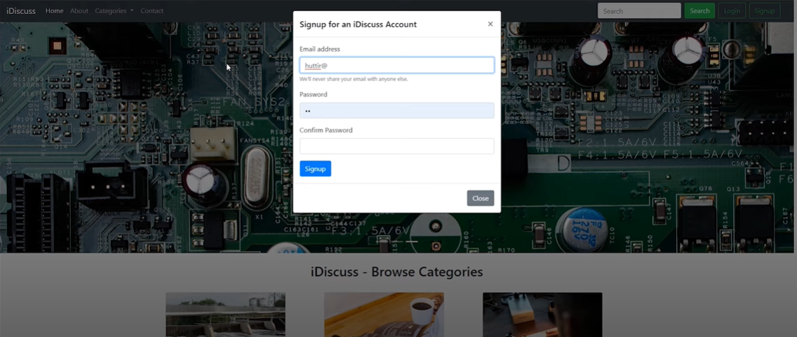
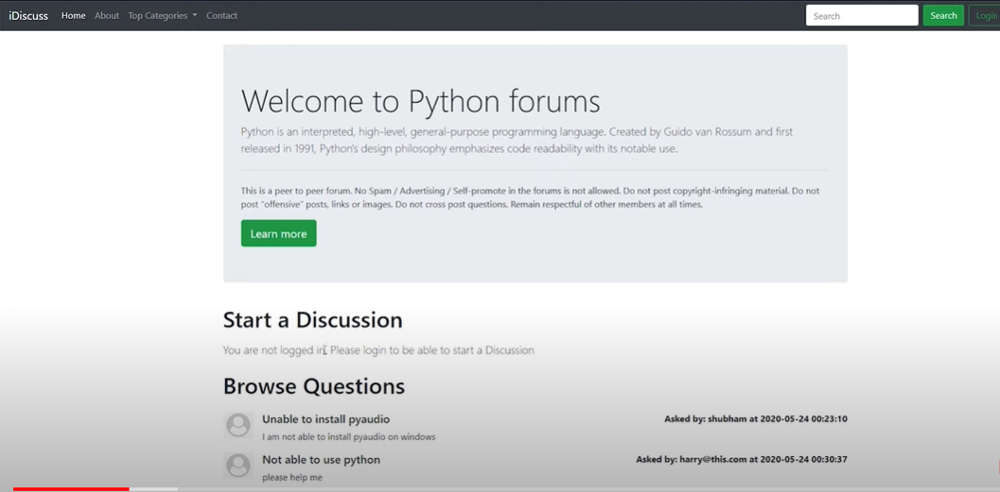

# forum
<h1> Forum Website</h1>

This is a simple forum website project created using JavaScript, HTML, CSS, and PHP. It allows users to create accounts, post and reply to threads, and interact in a forum-like environment.

<h3>Features</h3>
<ul>
  <li>User authentication and account creation.</li>
  <li>Forum thread creation and browsing.</li>
  <li>Posting and replying to threads.</li>
  <li>Basic user profile management.</li>
</ul>
 
Here are some snapshots from game.

  
